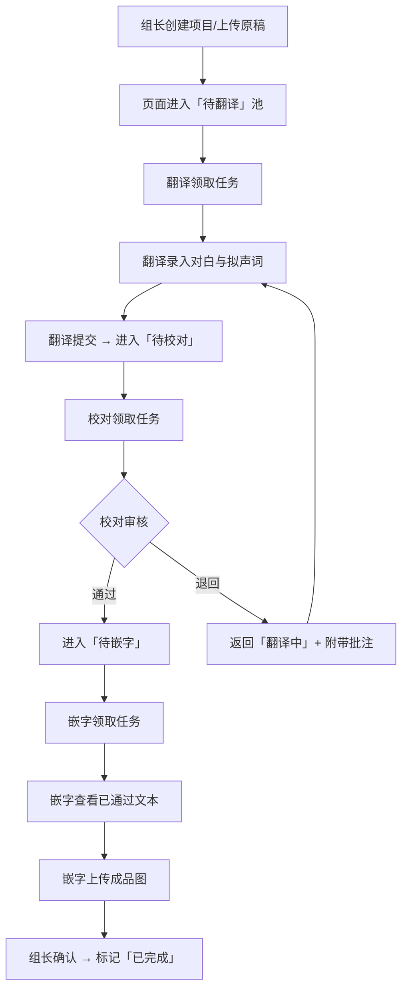
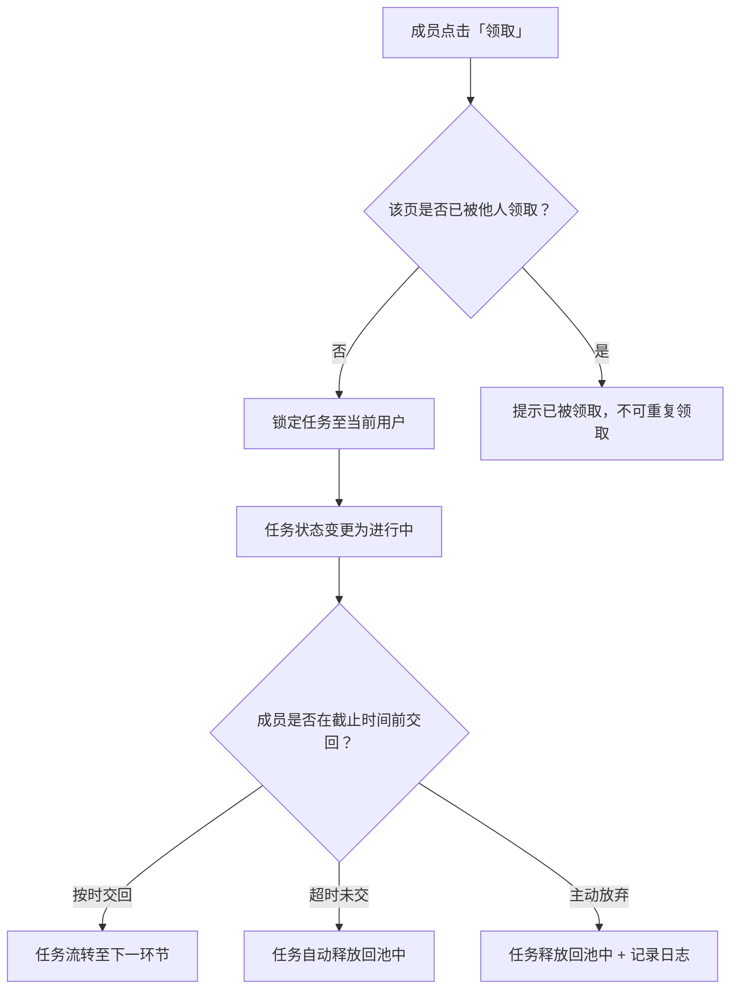

## 1. 产品概述

汉化协作看板是一款面向学生汉化组的轻量级 Web 协作工具，将翻译、校对、嵌字三类角色的流程串通，解决临时组队、课余碎片时间协作时"谁在做哪一页、下一步轮到谁"的核心痛点。
- 目标用户：以社团形式运营的学生汉化组，成员流动性大、协作时间碎片化
- 核心价值：零学习成本的看板式协作，让每一步流转有迹可循，杜绝撞车与遗漏

## 2. 核心功能

### 2.1 用户角色

| 角色 | 加入方式 | 核心权限 |
|------|----------|----------|
| 组长 | 创建项目时自动成为 | 管理项目/成员、筛选逾期页面、查看瓶颈统计、调整任务分配 |
| 翻译 | 被组长邀请或申请加入 | 领取翻译任务、录入对白与拟声词、提交翻译稿 |
| 校对 | 被组长邀请或申请加入 | 领取校对任务、在句子旁标注意见、通过/退回翻译稿 |
| 嵌字 | 被组长邀请或申请加入 | 查看已通过校对的文本、领取嵌字任务、上传成品图 |

### 2.2 功能模块

1. **看板首页**：项目概览、进行中任务统计、逾期预警、成员工作负荷一览
2. **项目页**：按作品 → 章节 → 页码层级展示，每页卡片显示原图缩略图、翻译稿状态、校对意见、嵌字进度
3. **页面工作台**：翻译录入区、校对批注区、嵌字作业区（按角色展示不同面板）
4. **成员与统计页**：成员列表、按成员筛选逾期页面、瓶颈环节统计

### 2.3 页面详情

| 页面名称 | 模块名称 | 功能描述 |
|----------|----------|----------|
| 看板首页 | 项目卡片列表 | 展示所有参与项目，显示总页数、完成率、逾期数 |
| 看板首页 | 进行中任务 | 当前用户待处理任务（待翻译/待校对/待嵌字）快捷入口 |
| 看板首页 | 逾期预警 | 超过截止日期未完成的任务高亮展示 |
| 看板首页 | 瓶颈统计 | 可视化显示卡在翻译/校对/嵌字环节的页面数量 |
| 项目页 | 作品/章节导航 | 左侧树形导航，按作品和章节组织 |
| 项目页 | 页面卡片网格 | 每页一张卡片，显示缩略图、当前状态标签、负责人头像、进度条 |
| 项目页 | 筛选与排序 | 按状态/负责人/逾期筛选，按页码/更新时间排序 |
| 页面工作台 | 原图展示区 | 左侧展示原页图片，支持缩放 |
| 页面工作台 | 台词录入区（翻译） | 逐格录入对白与拟声词，每条台词有编号，可标注气泡位置 |
| 页面工作台 | 校对批注区（校对） | 每条翻译旁可添加批注：语气不对/称呼需统一/梗需注释/其他，支持通过或退回 |
| 页面工作台 | 嵌字作业区（嵌字） | 仅显示已通过校对的文本，提供上传成品图按钮 |
| 页面工作台 | 任务流转栏 | 顶部显示当前状态流转：翻译中 → 待校对 → 校对通过 → 嵌字中 → 已完成 |
| 成员与统计页 | 成员列表 | 显示每位成员的角色、在办任务数、已完成数 |
| 成员与统计页 | 逾期筛选 | 按成员筛选逾期页面，组长可查看所有人的逾期任务 |
| 成员与统计页 | 瓶颈分析 | 各环节堆积数量柱状图，帮助组长识别瓶颈 |

## 3. 核心流程

### 3.1 任务流转主流程

组长创建项目并上传原稿图片，按章节和页码组织。翻译成员从"待翻译"池中领取页面，逐格录入对白与拟声词后提交。校对成员领取"待校对"的页面，逐句审核并标注意见，通过则流转至嵌字环节，退回则返回翻译重新修改。嵌字成员仅能看到已通过校对的文本，领取后进行嵌字并上传成品图，组长确认后标记完成。

### 3.2 任务领取机制

## 4. 用户界面设计

### 4.1 设计风格

- **主色调**：深墨色 (#1a1a2e) 为底，搭配暖橙 (#e94560) 作为强调色，营造漫画社的夜读氛围
- **辅助色**：翻译蓝 (#0f3460)、校对绿 (#16c79a)、嵌字橙 (#f5a623) 分别标识三个环节
- **按钮风格**：圆角胶囊按钮，带微妙阴影，hover 时轻微上浮
- **字体**：标题使用 ZCOOL KuaiLe（站酷快乐体），正文使用 Noto Sans SC，营造社团趣味感
- **布局风格**：左侧固定导航 + 右侧内容区，卡片网格展示，顶部状态横幅
- **图标风格**：线性图标搭配微渐变，漫画风气泡装饰元素

### 4.2 页面设计概览

| 页面名称 | 模块名称 | UI 元素 |
|----------|----------|---------|
| 看板首页 | 项目卡片列表 | 卡片带缩略图背景、完成率环形进度、逾期红色角标 |
| 看板首页 | 进行中任务 | 三列横向滚动卡片（翻译/校对/嵌字），每张卡片带状态色条 |
| 看板首页 | 逾期预警 | 红色警告横幅，折叠式逾期任务列表 |
| 看板首页 | 瓶颈统计 | 三色横向柱状图（翻译蓝/校对绿/嵌字橙） |
| 项目页 | 章节导航 | 左侧竖向折叠树，当前章节高亮，带进度百分比 |
| 项目页 | 页面卡片网格 | 正方形缩略图卡片，底部状态色条+负责人头像+截止时间 |
| 项目页 | 筛选栏 | 顶部胶囊筛选器组，状态多选+成员下拉+排序切换 |
| 页面工作台 | 原图展示区 | 左侧 40% 宽度，图片可缩放，气泡区域可框选编号 |
| 页面工作台 | 台词录入区 | 右侧可编辑列表，每行：编号 + 对白输入框 + 拟声词标记 + 类型标签 |
| 页面工作台 | 校对批注区 | 对白旁浮动批注气泡，四类预设标签+自由文本，通过/退回按钮 |
| 页面工作台 | 嵌字作业区 | 纯文本列表（只读）+ 拖拽上传区域，成品图预览 |
| 页面工作台 | 流转状态栏 | 顶部横向步骤条，当前步骤高亮，已完成步骤打勾 |
| 成员统计页 | 成员列表 | 头像 + 角色标签 + 任务数徽章，组长可展开逾期明细 |
| 成员统计页 | 瓶颈分析 | 堆叠柱状图，按环节分色，支持按时间范围筛选 |

### 4.3 响应式设计

- 桌面优先设计，核心使用场景为 PC 端浏览器
- 平板端：页面工作台改为上下布局（图在上，文本在下）
- 移动端：简化为列表视图，保留核心领取/提交功能

### 4.4 3D 场景指导

不适用
