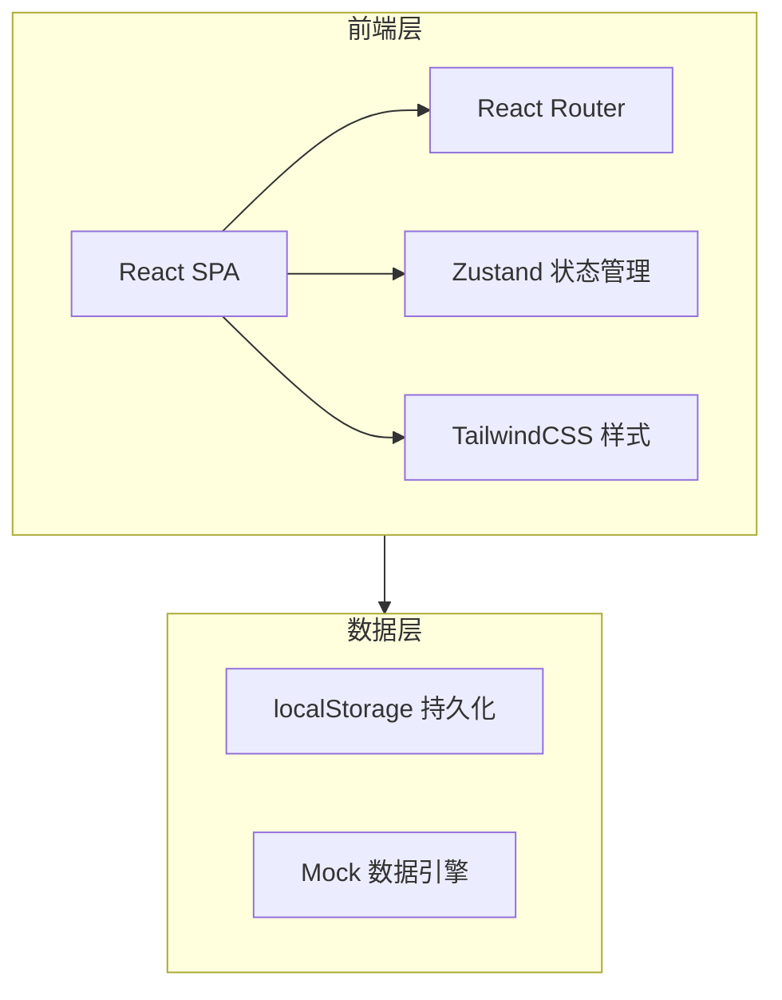
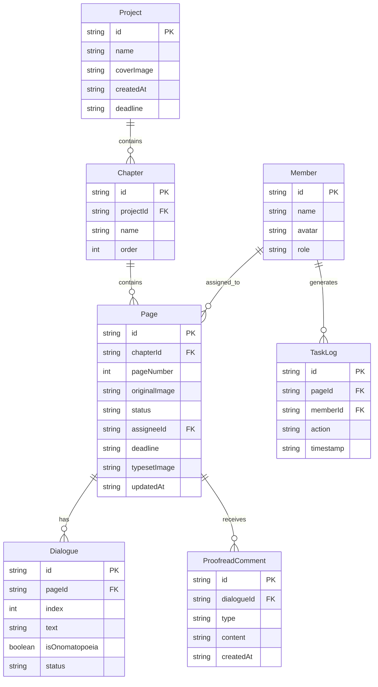

## 1. 架构设计



本方案采用纯前端架构，所有数据通过 localStorage 持久化存储，内置 Mock 数据引擎提供完整演示数据。无需后端服务，适合学生汉化组快速部署使用（可放在任意静态托管上）。

## 2. 技术说明

- **前端**：React@18 + TailwindCSS@3 + Vite
- **初始化工具**：Vite (react-ts template)
- **后端**：无（纯前端方案，数据存储在 localStorage）
- **数据库**：localStorage + Mock 数据
- **状态管理**：Zustand（轻量级，适合中小型应用）
- **路由**：React Router v6
- **图标**：Lucide React
- **图表**：Recharts
- **字体**：ZCOOL KuaiLe + Noto Sans SC（Google Fonts）

## 3. 路由定义

| 路由 | 用途 |
|------|------|
| `/` | 看板首页，项目概览与个人任务 |
| `/project/:projectId` | 项目页，章节导航 + 页面卡片网格 |
| `/project/:projectId/page/:pageId` | 页面工作台，翻译/校对/嵌字作业 |
| `/members` | 成员与统计页，逾期筛选与瓶颈分析 |

## 4. API 定义

无后端 API。前端通过 Zustand store + localStorage 实现数据持久化，数据操作函数封装在 store 中。

### 4.1 核心 Store 接口定义

```typescript
interface Project {
  id: string
  name: string
  coverImage: string
  chapters: Chapter[]
  createdAt: string
  deadline: string
}

interface Chapter {
  id: string
  name: string
  pages: Page[]
}

interface Page {
  id: string
  pageNumber: number
  originalImage: string
  status: 'pending_translate' | 'translating' | 'pending_proofread' | 'proofreading' | 'pending_typeset' | 'typesetting' | 'completed'
  assignee: Member | null
  deadline: string
  dialogues: Dialogue[]
  proofreadComments: ProofreadComment[]
  typesetImage: string | null
  updatedAt: string
}

interface Dialogue {
  id: string
  index: number
  text: string
  isOnomatopoeia: boolean
  status: 'draft' | 'submitted' | 'approved' | 'rejected'
}

interface ProofreadComment {
  id: string
  dialogueId: string
  type: 'tone' | 'naming' | 'meme_note' | 'other'
  content: string
  createdAt: string
}

interface Member {
  id: string
  name: string
  avatar: string
  role: 'leader' | 'translator' | 'proofreader' | 'typesetter'
}

interface TaskLog {
  id: string
  pageId: string
  memberId: string
  action: 'claimed' | 'submitted' | 'released' | 'approved' | 'rejected'
  timestamp: string
}
```

## 5. 服务器架构图

不适用（纯前端方案）

## 6. 数据模型

### 6.1 数据模型定义



### 6.2 Mock 数据策略

应用首次加载时检测 localStorage 中是否有数据，若无则写入预置 Mock 数据：

- 2 个示例项目（各含 2 个章节，每章节 4-6 页）
- 6 位示例成员（1 组长 + 2 翻译 + 2 校对 + 1 嵌字）
- 各页面处于不同流转状态，覆盖完整生命周期
- 部分页面设为逾期状态，用于演示预警功能
